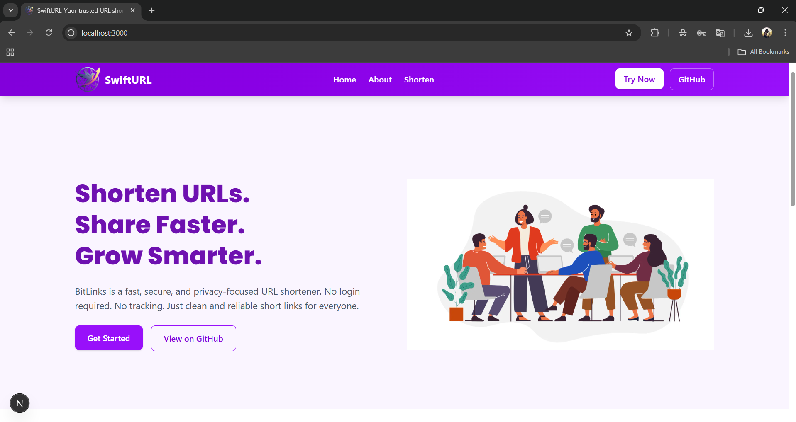

# 🔗 SwiftURL – URL Shortener

SwiftURL is a simple and fast URL shortener that converts long links into short, clean, and share-friendly URLs.

---

## ✨ Project Overview

Sharing long URLs can be inconvenient and messy. **SwiftURL** solves this problem by generating short URLs instantly, making link sharing easier and more efficient.

This project focuses on simplicity, clean code, and ease of use.

---

## 🚀 Features

- Convert long URLs into short URLs  
- Clean and minimal user interface  
- Fast and lightweight performance  
- Easy to use  
- Beginner-friendly project structure  

---
## 📸 Screenshot

---

## 🖥️ How It Works

1. The user enters a long URL  
2. The system generates a unique short URL  
3. The short URL redirects to the original link  

---

## 🛠️ Tech Stack

- **Frontend:** HTML, CSS, JavaScript  
- **Backend:** Node.js  
- **Framework:** Next.js  
- **Database:** MongoDB  

---

## 📂 Use Cases

- Social media link sharing  
- Marketing and promotional links  
- Academic or learning projects  
- Personal portfolio showcase  

---

## 🌟 Why SwiftURL?

- Simple logic and clean design  
- Easy to understand codebase  
- Practical real-world application  
- Ideal for beginners and portfolio projects  

---

**Rahul Patil**  
GitHub: https://github.com/Rahul-9307  

---

⭐ If you find this project useful, please consider giving it a star!
